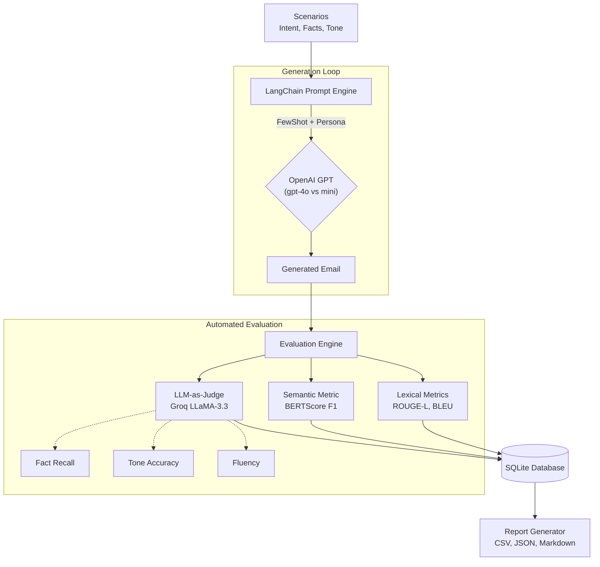

# AI Email Generation Assistant

> **AI Engineer Candidate Assessment** — Production-grade LLM evaluation pipeline.

An end-to-end email generation and evaluation system that takes structured inputs (intent, key facts, tone), generates professional emails using OpenAI GPT models, scores output quality across 6 custom metrics, compares two model strategies, and produces structured evaluation reports.

---

## System Architecture



---

## Tech Stack

| Layer | Technology |
|---|---|
| Language | Python 3.11+ |
| LLM — Generation | OpenAI `gpt-4o` (Model A) vs `gpt-4o-mini` (Model B) |
| LLM — Judge | Groq free tier (`llama-3.3-70b-versatile`) |
| Prompt Engineering | LangChain `ChatPromptTemplate` + `FewShotChatMessagePromptTemplate` |
| Chain Composition | LangChain LCEL (`prompt \| llm \| StrOutputParser`) |
| Evaluation: Lexical | ROUGE-L (`rouge-score`), BLEU (`nltk`) |
| Evaluation: Semantic | BERTScore F1 (`bert_score`, `roberta-large`) |
| Evaluation: Custom | 3 LLM-as-Judge metrics via Groq (Fact Recall, Tone Accuracy, Fluency) |
| Data Storage | SQLite (`sqlite3` built-in) |
| Output Reports | CSV + JSON + Markdown (`pandas`) |
| Config | YAML (`pyyaml`) |
| Validation | Pydantic v2 |
| Environment | `pip + venv` |
| Version Control | Git + GitHub |
| Testing | `pytest` |

---

## Repository Structure

```
email-generation-assistant/
├── README.md
├── requirements.txt
├── config.yaml                  # Model configs, weights, DB path
├── .env.example                 # API key template
├── .gitignore
│
├── data/
│   ├── scenarios.json           # 10 test scenarios (intent, facts, tone)
│   └── reference_emails.json   # 10 human-written reference emails (ground truth)
│
├── src/
│   ├── main.py                  # Entry point — full pipeline orchestration
│   ├── models.py                # Pydantic v2 schemas
│   ├── db.py                    # SQLite persistence layer
│   ├── prompt_engine.py         # LangChain ChatPromptTemplate + FewShot
│   ├── chains.py                # LCEL chain factory (generation + judge)
│   ├── generation_client.py     # ChatOpenAI wrapper + TokenUsageCallback
│   ├── llm_judge.py             # ChatGroq judge chains + score parsing
│   ├── evaluation_engine.py     # All 6 metrics + composite scoring
│   └── report_generator.py      # CSV / JSON / Markdown report output
│
├── outputs/                     # Created at runtime (git-ignored)
│   ├── evaluation_results.csv
│   ├── evaluation_results.json
│   ├── analysis_summary.md
│   ├── evaluation.db
│   └── pipeline.log
│
├── tests/
│   ├── test_models.py
│   ├── test_prompt_engine.py
│   ├── test_chains.py
│   └── test_evaluation_engine.py
│
└── docs/
    └── final_report.md
```

---

## Setup

### 1. Clone the repository

```bash
git clone https://github.com/<your-username>/email-generation-assistant.git
cd email-generation-assistant
```

### 2. Create and activate virtual environment

```bash
# Windows
python -m venv venv
venv\Scripts\activate

# macOS / Linux
python -m venv venv
source venv/bin/activate
```

### 3. Install dependencies

```bash
pip install -r requirements.txt
```

### 4. Download NLTK data

```bash
python -c "import nltk; nltk.download('punkt'); nltk.download('punkt_tab')"
```

> **Note:** BERTScore (`roberta-large`) downloads ~1.5 GB on first run and caches locally.

### 5. Configure API keys

```bash
cp .env.example .env
```

Edit `.env` and add your keys:

```
OPENAI_API_KEY=sk-your-openai-api-key-here
GROQ_API_KEY=gsk_your-groq-api-key-here
```

Get your free Groq API key at: https://console.groq.com

---

## Running the Pipeline

### Full pipeline (recommended)

```bash
python -m src.main
```

This runs all 13 steps: load → validate → generate (both models) → evaluate → report.

### Partial runs

```bash
# Only run Model A (gpt-4o)
python -m src.main --model-a-only

# Only run Model B (gpt-4o-mini)
python -m src.main --model-b-only

# Skip generation — re-evaluate from DB results
python -m src.main --skip-generation

# Regenerate reports from latest DB run
python -m src.main --report-only
```

---

## Outputs

After running the pipeline, the `outputs/` directory contains:

| File | Description |
|---|---|
| `evaluation_results.csv` | 20 rows (10 scenarios × 2 models), all 6 metric scores + metadata |
| `evaluation_results.json` | Nested JSON with full run metadata, token counts, generated emails |
| `analysis_summary.md` | Human-readable report: definitions, raw scores, averages, winner, recommendation |
| `evaluation.db` | SQLite database with all scenarios, results, and scores |
| `pipeline.log` | Full structured execution log |

---

## Evaluation Metrics

| # | Metric | Type | Definition | Target |
|---|--------|------|------------|--------|
| 1 | **ROUGE-L** | Lexical | Longest common subsequence F1 vs reference email | ≥ 0.40 |
| 2 | **BLEU** | Lexical | n-gram precision (1–4) with brevity penalty | ≥ 0.20 |
| 3 | **BERTScore-F1** | Semantic | Token-level semantic similarity via `roberta-large` | ≥ 0.85 |
| 4 | **Fact Recall** *(Custom 1)* | LLM Judge | Fraction of key facts present in generated email | ≥ 0.90 |
| 5 | **Tone Accuracy** *(Custom 2)* | LLM Judge | 1–5 tone match rating (normalised 0–1) | ≥ 0.80 |
| 6 | **Fluency & Prof.** *(Custom 3)* | LLM Judge | 1–5 grammar/clarity/professionalism rating | ≥ 0.70 |

**Composite Score:**
```
composite = 0.25×ROUGE-L + 0.10×BLEU + 0.15×BERTScore + 0.20×FactRecall + 0.15×ToneAccuracy + 0.15×Fluency
```

---

## Advanced Prompting Technique

This project uses **Few-Shot Prompting + Role-Playing** via LangChain:

1. **SystemMessagePromptTemplate** — assigns a 20-year expert persona to the LLM
2. **FewShotChatMessagePromptTemplate** — injects 3 curated gold-standard example pairs (human → ai turns)
3. **HumanMessagePromptTemplate** — carries the actual scenario inputs (`intent`, `facts`, `tone`)

All assembled as a `ChatPromptTemplate` composed via the LCEL pipe operator:
```python
chain = prompt | ChatOpenAI(model="gpt-4o") | StrOutputParser()
email = chain.invoke({"intent": ..., "facts": ..., "tone": ...})
```

---

## Running Tests

```bash
# All tests (fully offline — no API calls)
python -m pytest tests/ -v

# Specific test file
python -m pytest tests/test_prompt_engine.py -v
python -m pytest tests/test_evaluation_engine.py -v
```

---

## Model Comparison

| Aspect | Model A — `gpt-4o` | Model B — `gpt-4o-mini` |
|---|---|---|
| **Role** | Primary / production candidate | Comparison / cost-efficient baseline |
| **Cost** | Higher per token | ~10× cheaper |
| **Expected Strength** | Fact fidelity, nuanced tone | Speed, cost |
| **Judge** | Groq `llama-3.3-70b-versatile` (free tier) | Same judge for fairness |

---

## Cost Estimate

| Task | Model | Est. Cost |
|---|---|---|
| 10 email generations | `gpt-4o` | ~$0.02 |
| 10 email generations | `gpt-4o-mini` | ~$0.002 |
| 60 LLM judge calls | Groq free tier | **$0.00** |
| BERTScore (CPU) | Local | **$0.00** |
| **Total** | | **~$0.03** |

---

## Security

- API keys stored in `.env` only — never committed to Git (`.gitignore` enforced)
- `.env.example` committed as key template with placeholder values
- No raw user inputs are logged in production mode

---

## License

MIT
